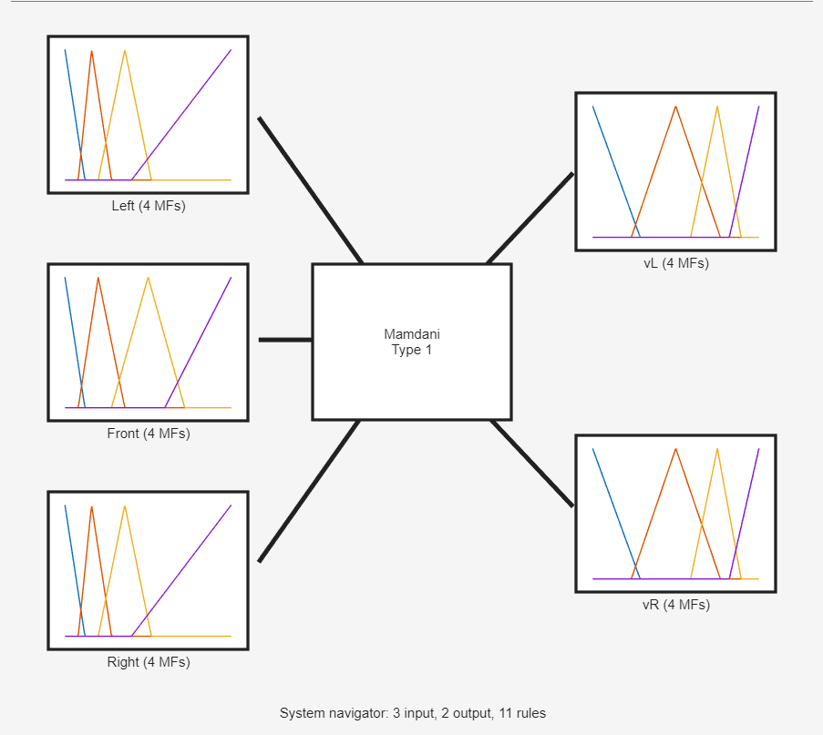
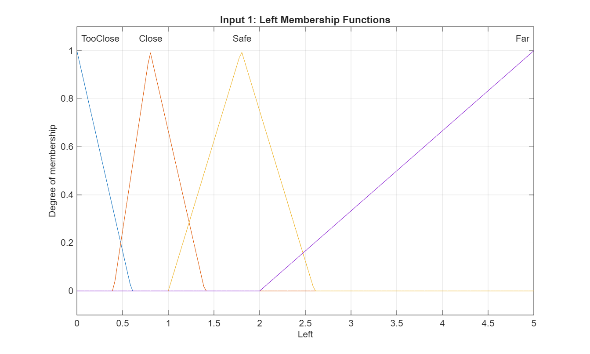
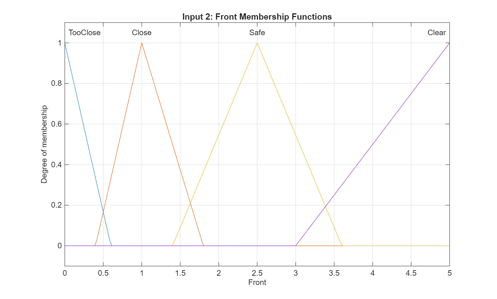
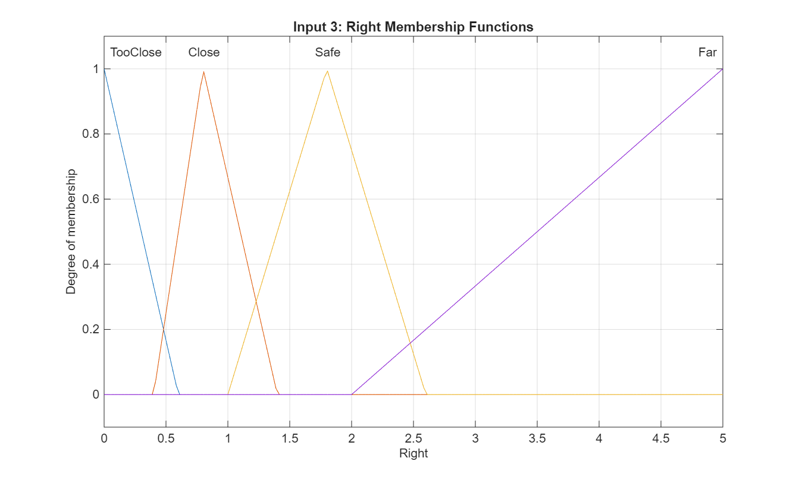
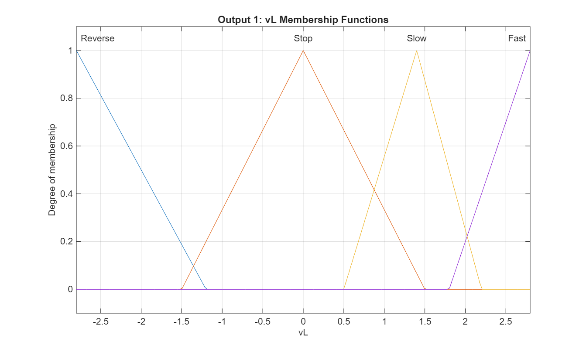
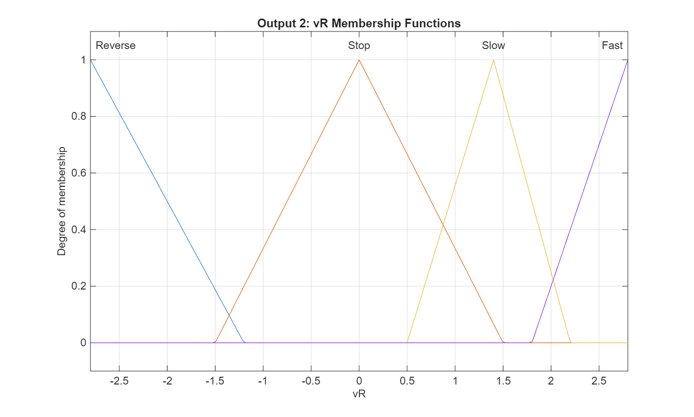
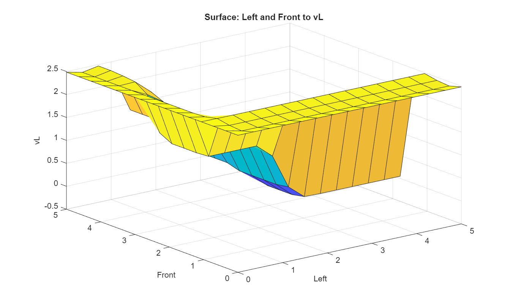
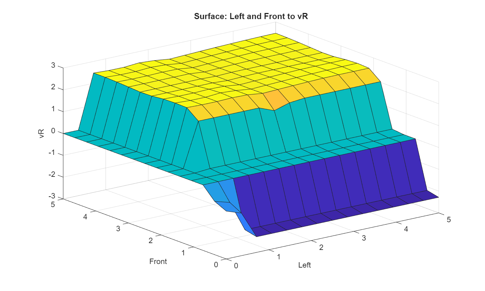

# Fuzzy Logic Maze Navigator

An autonomous differential-drive robot that navigates a randomly generated maze using a **Mamdani Fuzzy Inference System** built in MATLAB.

The robot has only 3 distance sensors (Left, Front, Right) and must reach the goal in the top-right corner starting from the bottom-left — without hitting any walls.

---

## Demo



---

## How It Works

The controller uses a **Mamdani FIS** (`navigator.fis`) with:

| | Detail |
|---|---|
| **Inputs** | `Left`, `Front`, `Right` sensor distances `[0–5]` m |
| **Outputs** | `vL`, `vR` wheel speeds `[-2.8, 2.8]` m/s |
| **FIS Type** | Mamdani |
| **Extra logic** | Stuck recovery, goal-aware turning, speed scaling |

The MATLAB controller (`myController.m`) wraps the FIS output with stateful logic for smoother, more reliable navigation.

---

## Membership Functions

| Left Sensor | Front Sensor | Right Sensor |
|---|---|---|
|  |  |  |

| Output vL | Output vR |
|---|---|
|  |  |

---

## FIS Surface Plot

| vL Response | vR Response |
|---|---|
|  |  |

---

## Rule Base


---

## Files

| File | Description |
|---|---|
| `myController.m` | Main robot controller (submit this) |
| `navigator.fis` | Saved Mamdani FIS |
| `build_navigator_fis.m` | Script to rebuild the FIS from scratch |
| `mazeSim.m` | Maze simulator with UI |
| `runSimulation.m` | One-click script to run the simulation |

---

## How to Run

1. Open MATLAB
2. Open the project folder
3. Run:
```matlab
runSimulation
```

---

## Course

**Intelligent Control** — Year 3, Second Term
