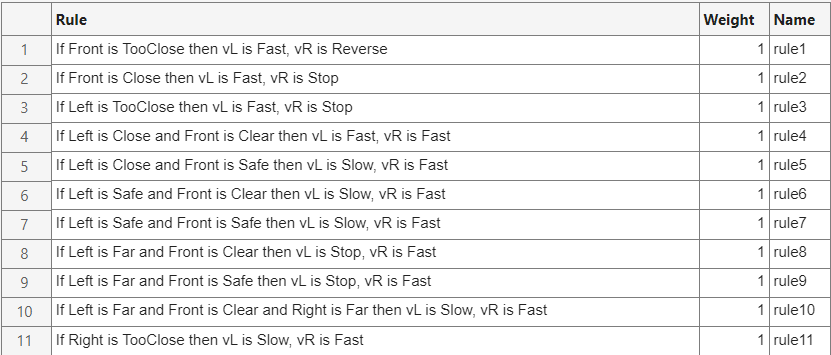

# Autonomous Maze Navigation using Fuzzy Logic (MATLAB)

A **Mamdani Fuzzy Logic Inference System** that autonomously navigates a differential-drive robot through a randomly generated 2D maze — no map, no path planner, purely reactive sensor-driven behaviour augmented with a lightweight state machine.

> **Course:** Intelligent Control (MEC2310) — Helwan National University, Robotics & Mechatronics Dept.  
> **Supervised by:** Prof. Dr. Helmy AL-Zoghby · **TA:** Eng. Ahmed Abd AL-AAL  
> **Team:** Mohamad Sherif Shabrawy · Yousef Ahmed Elbeltagy · Amr Sherif Maher

---

## Demo

| GUI Dashboard | Rule Base |
|:---:|:---:|
|  |  |

---

## Results

The controller was validated across all three supported maze sizes with **100% goal-reaching rate and zero wall collisions**:

| Maze Size | Physical Dims | Time | Distance | Notes |
|---|---|---|---|---|
| 15 × 15 | 45 m × 45 m | 21.0 s | 30.91 m | Fastest run; direct path |
| 21 × 21 | 63 m × 63 m | 71.5 s | 112.54 m | Multiple T-junctions handled |
| 21 × 21 | 63 m × 63 m | 74.3 s | 126.46 m | Different random layout |
| 27 × 27 | 81 m × 81 m | 51.9 s | 78.29 m | Escape mode triggered once |

**Max straight-line speed achieved: 2.80 m/s** (physical platform limit)

---

## How It Works

The robot carries three ray-cast LiDAR sensors (left, front, right). Every simulation frame, the fuzzy controller reads filtered sensor distances and outputs left/right wheel velocities through a **4-state finite state machine**:

| State | Behaviour | Entry Condition |
|---|---|---|
| `straight` | Default forward driving with FIS-guided speed + wall correction | Always (default) |
| `turn` | Rotate to new 90° heading, ramped via smoothTurn | Front blocked + side open |
| `commit` | Short post-turn forward phase, prevents re-triggering | After turn angle reached |
| `escape` | Reverse-arc or in-place 180° spin for dead-end recovery | Front < 0.14 m or dead end |

---

## Fuzzy Inference System

### FIS Properties

| Property | Value |
|---|---|
| FIS Name | `navigator` |
| FIS Type | Mamdani Type 1 |
| Inputs | 3 — Left, Front, Right sensor distances [0, 5] m |
| Outputs | 2 — vL, vR wheel speeds [−2.8, 2.8] m/s |
| Rules | 11 |
| AND Method | min |
| Aggregation | max |
| Defuzzification | centroid |

### Input Membership Functions (triangular — trimf)

**Left / Right sensors** (symmetric):

| MF | Parameters | Meaning |
|---|---|---|
| TooClose | [0.0, 0.0, 0.6] | Dangerously close — steer away immediately |
| Close | [0.4, 0.8, 1.4] | Ideal following distance |
| Safe | [1.0, 1.8, 2.6] | Comfortable — nudge gently |
| Far | [2.0, 5.0, 5.0] | Open space — turn to find wall |

**Front sensor:**

| MF | Parameters | Meaning |
|---|---|---|
| TooClose | [0.0, 0.0, 0.6] | Emergency — spin right instantly |
| Close | [0.4, 1.0, 1.8] | Wall approaching — begin turn |
| Safe | [1.4, 2.5, 3.6] | Usable space — normal travel |
| Clear | [3.0, 5.0, 5.0] | Fully open — full speed |

**Output MFs** (vL and vR, identical):

| MF | Parameters | Meaning |
|---|---|---|
| Reverse | [−2.8, −2.8, −1.2] | Wheel reverses — escape/spin |
| Stop | [−1.5, 0.0, 1.5] | Wheel near stopped |
| Slow | [0.5, 1.4, 2.2] | Cautious forward / inner turn wheel |
| Fast | [1.8, 2.8, 2.8] | Full forward / outer turn wheel |

### 11-Rule Base

| # | Left | Front | Right | vL | vR | Behaviour |
|---|---|---|---|---|---|---|
| 1 | — | TooClose | — | Fast | Reverse | Emergency: spin right in place |
| 2 | — | Close | — | Fast | Stop | Front approaching: turn right |
| 3 | TooClose | — | — | Fast | Stop | Left too close: steer right |
| 4 | Close | Clear | — | Fast | Fast | Ideal left + clear front: full speed straight |
| 5 | Close | Safe | — | Slow | Fast | Ideal left + safe front: lean slightly left |
| 6 | Safe | Clear | — | Slow | Fast | Left too far + clear: steer left to recover |
| 7 | Safe | Safe | — | Slow | Fast | Left too far + safe: continue left correction |
| 8 | Far | Clear | — | Stop | Fast | Open left + clear: hard left turn |
| 9 | Far | Safe | — | Stop | Fast | Open left + safe: turn left |
| 10 | Far | Clear | Far | Slow | Fast | All open: lean left to find wall |
| 11 | — | — | TooClose | Slow | Fast | Right too close: steer left |

*"—" = don't care (rule fires for any value of that input)*

---

## Controller Features

- **IIR Sensor Filtering** — side sensors: α=0.78, front sensor: α=0.55 (less filtering for faster hazard response)
- **Goal-Aware Turn Scoring** — cosine alignment scoring to bias branch decisions toward top-right goal without a map. Adaptive goal estimation by maze size: 15×15→[13,13], 21×21→[19,19], 27×27→[25,25]
- **T-Junction Locking** — 40-frame commit (vs 24 for normal turns) prevents left-right oscillation at junctions
- **Start Stabilisation** — 18-frame launch phase limits speed to 2.30 m/s until robot leaves start cell
- **Dead-End Escape** — in-place 180° spin with goal-aware spin direction selection
- **Nose-on-Wall Escape** — reverse-arc manoeuvre (negative speed + lateral turn)
- **Cascade Speed Architecture** — 5 sequential scaling layers achieve 2.80 m/s in clear corridors while decelerating smoothly near walls

---

## Getting Started

**Requirements:** MATLAB R2021a or later + **Fuzzy Logic Toolbox**

```matlab
% Navigate to the project folder and run:
runSimulation
```

This auto-regenerates `navigator.fis` if missing, then launches the simulator with `myController` in AUTO mode.

To use your own controller:
```matlab
mazeSim(@yourControllerFunction)
```

---

## Project Structure

```
fuzzy-logic-maze-runner/
├── mazeSim.m               # Simulation engine + real-time dashboard UI
├── myController.m          # Fuzzy controller — 4-state FSM + FIS integration
├── runSimulation.m         # Entry point — run this to start
├── build_navigator_fis.m   # Regenerates navigator.fis from scratch
├── navigator.fis           # Mamdani FIS (11 rules, 3 inputs, 2 outputs)
├── MATLABMazeRunnerWorking.prj
└── docs/
    ├── figures/            # MF plots, surface plots, GUI screenshot
    ├── controller_fis_explanation.md
    ├── DETAILED_REPORT_SOURCE.md
    └── Fuzzy_Logic_Maze_Report_FINAL.pdf
```

---

## Documentation

- [`docs/Fuzzy_Logic_Maze_Report_FINAL.pdf`](docs/Fuzzy_Logic_Maze_Report_FINAL.pdf) — full report with MF plots, surface analysis, simulation results
- [`docs/controller_fis_explanation.md`](docs/controller_fis_explanation.md) — controller architecture and FSM details
